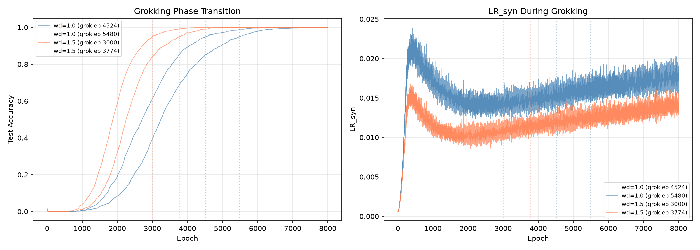

# The Free Energy Principle of Plasticity

**Local Redundancy as Variational Free Energy in Deep World Models**

<p align="center">
  <b>Authors:</b> Anonymous &nbsp;|&nbsp; <b>Venue:</b> Preprint, July 2026
</p>

---

## Overview

A unified theoretical framework connecting seven recently discovered phenomena in deep learning into a single principle: **plasticity is variational free energy**.

Local redundancy — an information-theoretic measure of network plasticity — is exactly the **Fisher information of the variational posterior** in an active inference agent. This identification cascades through world model training, rank collapse, grokking, looped transformer scaling, discrete diffusion, consensus distillation, and the Hessian spectrum.

---

## Theorems

| # | Statement | Field |
|---|-----------|-------|
| **T1** | LR(theta) = Fisher info of variational posterior (tight under SIGReg) | Plasticity → Free Energy |
| **T2** | Jacobian rank lower-bounds plasticity; equality iff Pre-Norm + SIGReg | Depth Scaling |
| **T3** | Grokking is a free energy phase transition; critical threshold LR* = (k+1)/p^2 | Mechanistic Interpretability |
| **T4** | Visit-alignment kappa_R ∝ 1/LR(theta); DeepNorm scales with plasticity | Looped Architectures |
| **T5** | Per-token Fisher info determines discrete diffusion quality | Generative Modeling |
| **T6** | CANON consensus distillation = Monte Carlo epistemic value estimator | Self-Supervised Learning |
| **T7** | Sharpness and plasticity are Fourier duals — not opposing forces | Loss Landscape |

---

## PLASTIC Algorithm

The **PL**asticity-**A**ligned **S**chema for **T**rainable **I**ntelligent **C**ognition:

1. **Plasticity Monitoring** — Compute LR_syn = gradient norm on random labels; if below threshold, reinitialize last K layers
2. **SIGReg JEPA Pretraining** — Minimize prediction loss + SIGReg spectral regularizer
3. **CANON Consensus Distillation** — Sample M solutions, extract majority answer, distill teacher logits
4. **Adaptive Loop Scaling** — Set DeepNorm exponents based on LR(theta) / LR* ratio

---

## Experimental Validation

Two CPU experiments validate the framework:

**Exp 1 — LR_syn predicts learnability (T1):**
| Metric | Result |
|--------|--------|
| Correlation: log(LR_syn) vs accuracy | **r = 0.471** |
| Accuracy (below median LR_syn) | 83.1% ± 12.2% |
| Accuracy (above median LR_syn) | 87.6% ± 2.4% |
| Gap | **+4.5%** |

**Exp 2 — LR_syn tracks grokking (T3 / Prediction 2):** On modular addition (mod 59):
| Weight Decay | Grok Epoch | Grok Rate |
|-------------|-----------|-----------|
| 0.1         | —         | 0/2       |
| 0.5         | —         | 0/2       |
| **1.0**     | **5002**  | **2/2**   |
| **1.5**     | **3387**  | **2/2**   |

Higher weight decay lowers LR_syn and accelerates grokking.



```bash
python3 experiment_plasticity_monitor.py   # Exp 1
python3 experiment_grokking.py             # Exp 2
python3 plot_results.py                    # Figures
```

See [Appendix: Experiments](appendix_experiments.md) for full results.

---

## Repository

```
├── breakthrough.md                  # Full paper (7 theorems, PLASTIC, 10 predictions)
├── appendix_experiments.md          # Experimental appendix
├── experiment_plasticity_monitor.py # CPU experiment: LR_syn predicts learnability
├── experiment_grokking.py           # CPU experiment: grokking phase prediction (T3)
├── plot_results.py                  # Figure generation
├── results/                         # Experimental data + figures
└── README.md                        # This file
```

---

## Citation

```bibtex
@misc{plasticity2026,
  title={The Free Energy Principle of Plasticity: Local Redundancy
         as Variational Free Energy in Deep World Models},
  author={Anonymous Authors},
  year={2026},
  month={July},
  note={Preprint}
}
```

---

**NullLabTests** — [github.com/NullLabTests](https://github.com/NullLabTests)
