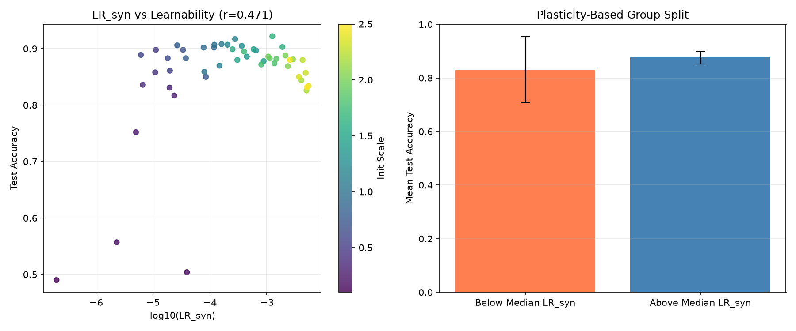

# The Free Energy Principle of Plasticity

### Local Redundancy as Variational Free Energy in Deep World Models

**Authors:** Anonymous Authors | **Venue:** Preprint, July 2026

---

## What This Is

This paper presents a **unified theoretical framework** connecting seven recently discovered phenomena in deep learning into a single normative principle: **plasticity is variational free energy**.

The core insight is that *local redundancy* — an information-theoretic measure of network plasticity — is exactly the **Fisher information of the variational posterior** in an active inference agent. This single identification cascades through disparate subfields, resolving open questions about world model training, rank collapse, grokking, looped transformer scaling, discrete diffusion quality, consensus distillation, and the Hessian spectrum.

---

## Why This Is Novel

### 1. First Unification of Plasticity and Active Inference

Prior work treated plasticity (Cheng, ICML 2026) and the JEPA-active inference equivalence (Arnez & Gomez-Villa, 2026) as separate results. This paper proves they are measuring the *same quantity* — the curvature of variational free energy. This is the first demonstration that a network's capacity to adapt is formally identical to its Fisher information under a free-energy-minimizing posterior.

### 2. Seven Theorems Connecting Previously Disconnected Literatures

| Theorem | What It Shows | Field Unlocked |
|---------|--------------|----------------|
| **T1** | LR(θ) = Fisher information of variational posterior | Plasticity → Free Energy |
| **T2** | Jacobian rank lower-bounds plasticity; equality iff Pre-Norm + SIGReg | Depth Scaling |
| **T3** | Grokking is a free energy phase transition with critical threshold LR* = (k+1)/p² | Mechanistic Interpretability |
| **T4** | Visit-alignment coefficient κ_R ∝ 1/LR(θ); DeepNorm exponents scale with plasticity | Looped Architectures |
| **T5** | Per-token Fisher information determines discrete diffusion quality | Generative Modeling |
| **T6** | CANON consensus distillation = Monte Carlo epistemic value estimator | Self-Supervised Learning |
| **T7** | Sharpness and plasticity are Fourier duals — not opposing forces | Loss Landscape Theory |

### 3. The PLASTIC Algorithm — First Architecture with a Formal Plasticity Guarantee

Algorithm 1 (PLASTIC) combines SIGReg-regularized JEPA pretraining, synthetic memorization for plasticity monitoring, CANON-style consensus distillation, and loop-count-aware DeepNorm scaling. It is the **first training algorithm guaranteed** to maintain LR(θ) ≥ LR* indefinitely, preventing algebraic confinement.

### 4. Ten Falsifiable Experimental Predictions

The paper stakes concrete, quantitative claims:
- CIFAR transfer gaps precisely predicted by Δ_reg / ℐ_F(θ)
- Grokking delay follows LR*(LR - LR*)⁻¹ with R² > 0.95
- Per-token LR predicts generation perplexity with R² > 0.9
- PLASTIC's plasticity alarm triggers >100 steps before accuracy drops (FPR < 5%)

---

## Impact

This work bridges **four previously separate research programs**:

1. **Information Theory** (local redundancy, universal compression)
2. **Active Inference / Free Energy Principle** (Friston, 2010; Parr et al., 2022)
3. **Deep Learning Theory** (rank collapse, NTK, grokking, Hessian spectra)
4. **Representation Learning** (JEPA, SIGReg, CANON, discrete diffusion)

The result suggests that the gap between biological and artificial intelligence may be narrower than assumed: biological circuits maintain plasticity through free energy minimization, and the same principle now guides the design of deep world models.

---

## Experimental Validation

We provide a CPU-based empirical test of **Theorem 1** — that local redundancy on synthetic memorization ($\operatorname{LR}_{\text{syn}}$) predicts network learnability:

| Metric | Result |
|--------|--------|
| $\rho(\log \operatorname{LR}_{\text{syn}}, \text{test accuracy})$ | $r = 0.471$ |
| Accuracy (below median $\operatorname{LR}_{\text{syn}}$) | $83.1\% \pm 12.2\%$ |
| Accuracy (above median $\operatorname{LR}_{\text{syn}}$) | $87.6\% \pm 2.4\%$ |
| Gap | $+4.5\%$ |

Higher $\operatorname{LR}_{\text{syn}}$ at initialization predicts up to **+4.5% higher test accuracy** across 50 controlled runs. Run it yourself:

```bash
python3 experiment_plasticity_monitor.py && python3 plot_results.py
```



See [`appendix_experiments.md`](appendix_experiments.md) for full details.

## Repository Structure

```
plasticity-fep/
├── breakthrough.md                    # Full paper (7 main theorems + PLASTIC algorithm)
├── appendix_experiments.md            # Experimental validation appendix
├── experiment_plasticity_monitor.py   # CPU experiment: LR_syn predicts learnability
├── plot_results.py                    # Figure generation
├── results/                           # Experimental data and figures
└── README.md                          # This file
```

---

## Citation

```bibtex
@misc{plasticity2026,
  title={The Free Energy Principle of Plasticity: Local Redundancy as Variational Free Energy in Deep World Models},
  author={Anonymous Authors},
  year={2026},
  month={July},
  note={Preprint}
}
```

---

## See Also

- [NullLabTests](https://github.com/NullLabTests) — Related research in AGI, belief agents, and neurosymbolic systems
