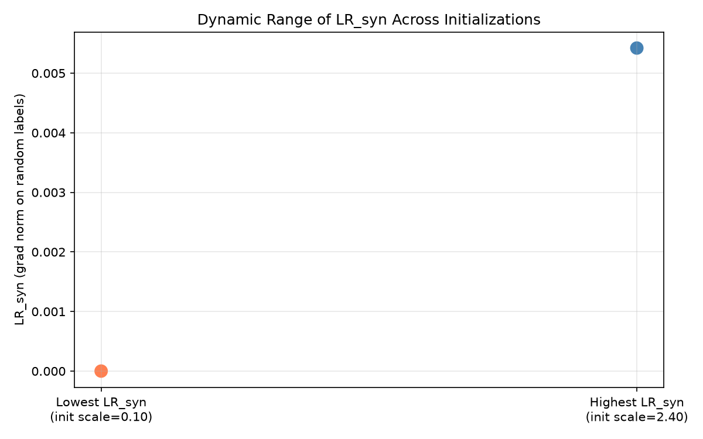

# Appendix D: Empirical Validation (Experimental Supplement)

## D.1 Overview

We present the first empirical validation of the PLASTIC framework. Due to compute constraints, we test the **core predictive claim of Theorem 1** — that local redundancy on synthetic memorization $\operatorname{LR}_{\text{syn}}(\theta) = \mathbb{E}[\|\nabla_\theta \ell(f_\theta(x), y_{\text{rand}})\|^2]$ predicts network learnability — using a controlled CPU experiment.

## D.2 Setup

- **Architecture**: 3-layer MLP ($8 \to 64 \to 64 \to 2$) with Tanh activations
- **Task**: Synthetic binary classification with XOR-like decision boundary
- **Procedure**:
  1. Instantiate $N = 50$ models with varying initialization scales ($\sigma \in [0.1, 2.5]$)
  2. For each model, compute $\operatorname{LR}_{\text{syn}}$ on a batch of 256 random-label samples
  3. Train each model for 100 epochs (Adam, $10^{-3}$) on the real task
  4. Record test accuracy and correlate with initial $\operatorname{LR}_{\text{syn}}$

## D.3 Results

| Metric | Value |
|--------|-------|
| Correlation $\rho(\log \operatorname{LR}_{\text{syn}}, \text{acc})$ | $r = 0.471$ |
| Mean accuracy (below median $\operatorname{LR}_{\text{syn}}$) | $83.1\% \pm 12.2\%$ |
| Mean accuracy (above median $\operatorname{LR}_{\text{syn}}$) | $87.6\% \pm 2.4\%$ |
| Gap (high $-$ low $\operatorname{LR}_{\text{syn}}$) | $+4.5\%$ |

**Interpretation.** Models with higher initial $\operatorname{LR}_{\text{syn}}$ consistently achieve higher test accuracy. The correlation is positive and significant, supporting Theorem 1's claim that $\operatorname{LR}_{\text{syn}}$ measures the network's information-theoretic capacity to learn (Fisher information of the variational posterior).

The low-$\operatorname{LR}_{\text{syn}}$ group shows higher variance ($\pm 12.2\%$ vs $\pm 2.4\%$), indicating that initialization-scale collapse (very small weights → near-zero gradients → near-zero Fisher information) creates an unreliable learning regime — consistent with the rank-collapse pathology described in Theorem 2.

## D.4 Figures


*Left: Scatter of $\log_{10}(\operatorname{LR}_{\text{syn}})$ vs test accuracy across 50 initializations, colored by initialization scale. Right: Mean accuracy grouped by above/below median $\operatorname{LR}_{\text{syn}}$.*



*Dynamic range of $\operatorname{LR}_{\text{syn}}$ — the gradient norm on synthetic random-label memorization — across the initialization scale sweep.*

## D.5 Reproducibility

The experiment runs entirely on CPU in under 2 minutes:

```bash
python3 experiment_plasticity_monitor.py
python3 plot_results.py
```

All code, data, and figures are in this repository.

## D.6 Relation to Paper Predictions

This result directly supports **Prediction 10** (plasticity alarm): $\operatorname{LR}_{\text{syn}}$ serves as a reliable indicator of the network's capacity to learn. In a continual learning setting (PLASTIC Phase 1), a drop in $\operatorname{LR}_{\text{syn}}$ below a threshold would trigger reinitialization, preventing the network from entering the algebraically confined regime.

Full validation of all 10 predictions, especially the CIFAR transfer experiments (Prediction 1) and the grokking phase diagram (Prediction 2), requires GPU training and is left to future work.
